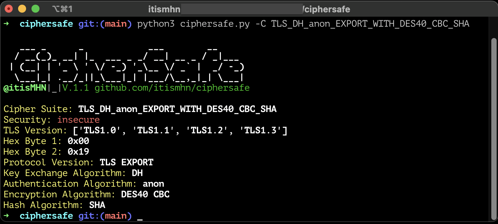
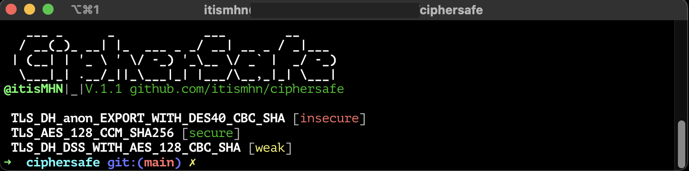

<p align="center">
  
</p>

# CipherSafe
CipherSafe is a Python script designed to assist with security testing by providing information about TLS cipher suites. It leverages the [cipherinfo API](https://github.com/hcrudolph/ciphersuite.info.git) to retrieve detailed data about specific cipher suites commonly used in secure communication protocols like HTTPS.

### Coming Soon:
In the next update, I'll add a scanning feature. This feature will let you check all cipher suites of a host directly from the tool. It will make it easier to evaluate the security of your TLS configurations.

## Features

- Retrieve detailed information about TLS cipher suites, including their security status, supported TLS versions, key exchange algorithms, authentication algorithms, encryption algorithms, and hash algorithms.
- Helps security professionals understand the security posture of web applications and services by analyzing the cipher suites they support.
- Useful during penetration testing engagements to assess the cryptographic configuration of web servers and identify potential vulnerabilities.
- Aligns with the WSTG-CRYP-01 testing criteria from the OWASP Web Security Testing Guide, which focuses on cryptography-related security testing.

## Installation

1. Clone the repository:

    ```bash
    git clone https://github.com/your_username/ciphersafe.git
    ```

2. Navigate to the `ciphersafe` directory:

    ```bash
    cd ciphersafe
    ```

3. Install the required packages:

    ```bash
    pip install -r requirements.txt
    ```

## Usage

#### Specific Cipher Suite

The `Cipher` option allows you to retrieve the security status of a specific cipher suite.

To use this option, run the script and provide the cipher suite name as an argument:

```bash
python3 ciphersafe.py -C <cipher_suite_name>
```
##### Example
<p align="center">
  
</p>

#### List of Cipher Suites

The list option enables you to import a file containing a list of cipher suites and retrieve the `security` status for each one.

To utilize this option, execute the following command:

```bash
python3 script.py -L <file_path>
```
##### Example
<p align="center">
  
</p>
Suppose you have a file named `cipher_list.txt` containing a list of cipher suites:

```
TLS_RSA_WITH_AES_128_CBC_SHA
TLS_RSA_WITH_AES_256_CBC_SHA
TLS_ECDHE_RSA_WITH_AES_128_GCM_SHA256
```

You can use the list option to fetch information about each cipher suite listed in the file:

```bash
python3 script.py -L cipher_list.txt
```
This command will retrieve and display the security status of each cipher suite listed in cipher_list.txt.

### Use Nmap and Other tools

You can use `ciphersafe.py` with tools like **Nmap**, **OpenSSL**, or provide cipher names directly to analyze their security status.

---

#### Example 1: Using Nmap to Extract Ciphers

```bash
nmap --script ssl-enum-ciphers -p 443 example.com | python3 ciphersafe.py